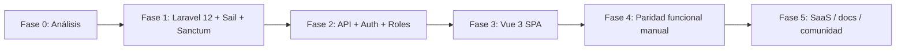

# Escolarsis / EBAM — Análisis de producto (versión actual)

> Documento de referencia previo al upgrade (Laravel 5.5 → 12, Vue 2 → 3, Sail, Sanctum).
> Basado en código fuente, manual de usuario (`USERGUIDE.md`) y revisión técnica del repositorio.

**Estructura del repositorio (2026):** código legacy en `legacy/`; desarrollo activo en `escolarsis-cloud/`.

## Resumen ejecutivo

**Escolarsis** (manual: sistema **EBAM** — *Student's course management system*) es un **SIS ligero** orientado a instituciones educativas pequeñas (escuelas, academias, cursos informales) que necesitan centralizar **estructura académica**, **matrículas**, **calificaciones por sesión/clase**, **promedios**, **reportes disciplinarios** y **horarios**, con acceso diferenciado por rol.

El stack actual (**Laravel 5.5**, **Vue 2**, sesión web + CSRF, **sin API REST real**) tiene **~8 años de antigüedad tecnológica**. Para relanzarlo en nube como producto abierto, el camino razonable es **reconstrucción guiada por dominio**: conservar el modelo de negocio y flujos del manual, reimplementar sobre Laravel moderno + frontend actualizado.

---

## 1. Uso y alcance posible

### 1.1 Qué resuelve hoy

| Área | Funcionalidad | Actores |
|------|---------------|---------|
| Institución | Datos de escuela (categoría) | Administrador |
| Estructura | Grupos, cursos, materias, periodos/unidades | Administrador; consulta según rol |
| Personas | Personal (personas), alumnos, usuarios y roles | Administrador |
| Inscripción | Matrícula grupo–curso (única por par) | Administrador |
| Operación docente | Sesiones: notas, asistencia, conducta por fecha/alumno/materia/periodo | Admin, Maestro |
| Seguimiento | Promedios por materia y por curso; export PDF | Todos (filtrado por rol) |
| Convivencia | Reportes de comportamiento inusual | Admin, Maestro, Alumno (lectura) |
| Logística | Horarios por curso/materia | Admin asigna; Maestro/Alumno consultan |
| Acceso | Login por usuario/contraseña; 3 roles | Todos |

### 1.2 Alcance recomendado para relanzamiento “abierto en nube”

**MVP cloud (institución única por tenant):**

- Multi-escuela opcional en fase 2 (actualmente el modelo asume **una institución** vía `categorias`).
- Roles: Administrador, Docente (Maestro), Estudiante (Alumno), y opcional **Tutor/padre** en fase 2.
- Flujos críticos del manual: matrícula → sesión de calificación → promedios → PDF boletas/horarios.

**Fuera de alcance inicial (evitar sobrecarga):**

- Nómina, inventario, facturación (restos de nombres `Vendedor`/`Almacenero`/`Cliente` en código).
- LMS completo (tareas, foros, videoconferencia).
- Normativa oficial por país (SEP/RVOE) sin configuración explícita.

**Segmentos de mercado realistas:**

1. **Escuelas privadas pequeñas** (50–500 alumnos) sin ERP educativo.
2. **Academias y centros de idiomas/cursos** con pocos niveles y alta rotación de grupos.
3. **Proyectos comunitarios / ONG** que necesitan registro gratuito y simple.
4. **Auto-hospedaje** (Sail/Docker) para quien no quiera SaaS.

### 1.3 Modelo de despliegue

El manual contempla:

- **Hosting público** (dominio + MySQL remoto).
- **Red local** (servidor 24/7 en LAN).

Para nube abierta conviene documentar tres modos:

| Modo | Público objetivo |
|------|------------------|
| SaaS multi-tenant | Escuelas sin equipo técnico |
| Single-tenant managed | Institución con dominio propio |
| Self-hosted (Sail/Docker Compose) | Comunidad open source |

---

## 2. Experiencia de uso (UX)

### 2.1 Fortalezas (según manual y UI)

- **Patrón consistente**: menú lateral + lista + botones Nuevo/Editar/Eliminar + búsqueda.
- **Flujo de calificación guiado**: curso → materia → periodo → fecha → alumno → notas (reduce errores de contexto).
- **Doble guardado en sesión**: “guardar sin cerrar” para captura masiva en un mismo día/clase.
- **Vistas por rol** documentadas con capturas (admin, maestro, alumno).
- **Responsive básico** mencionado en manual (acceso desde distintos dispositivos).

### 2.2 Debilidades y fricción

| Problema | Impacto |
|----------|---------|
| Navegación por `menu=N` en Blade + Vue global, sin vue-router activo | URLs no compartibles; difícil deep-linking y PWA |
| Duplicación masiva de rutas en `web.php` por rol | Mantenimiento costoso; riesgo de permisos inconsistentes |
| Errores expuestos al usuario (SQL duplicate, `MethodNotAllowed`) | Mala experiencia; manual pide F5 e “inspeccionar” |
| `ALTER TABLE AUTO_INCREMENT` documentado como solución | Antipatrón; indica diseño frágil de IDs |
| Nombres legacy en código (`Vendedor`, `Almacenero`) vs manual (`Maestro`, `Alumno`) | Confusión para desarrolladores y posible fallo de middleware |
| Sin recuperación de contraseña usable en flujo principal | Barrera en despliegue público |
| Accesibilidad e i18n limitadas | Solo español; contraste/ARIA no priorizados |

### 2.3 Hallazgo técnico crítico (permisos)

En `routes/web.php` los grupos usan middleware `Maestro` y `Alumno`, pero en `app/Http/Kernel.php` solo están registrados `Vendedor`, `Almacenero` y `Administrador` — y los tres **no validan rol** (solo `return $next($request)`).

La UI asigna roles por `idrol` (1=Admin, 2=Maestro, 3=Alumno) pero los sidebars se llaman `sidebarvendedor` / `sidebaralmacenero`.

**Conclusión:** antes de pruebas en producción hay que **unificar nomenclatura** y **implementar autorización real** (Policies/Gates o middleware con `idrol`).

---

## 3. Aplicación práctica real

### 3.1 Casos de uso día a día

1. **Inicio de ciclo**: crear grupos → alumnos → vincular grupo/curso → matrículas.
2. **Planeación**: cursos, materias, periodos, horarios.
3. **Clase**: maestro abre sesión, captura calificaciones/asistencia/conducta.
4. **Cierre de periodo**: consulta promedios por materia y por curso; genera PDF para padres o dirección.
5. **Disciplina**: reportes visibles según emisor y afectado.
6. **Estudiante**: consulta propios cursos, notas y horarios (solo lectura en sesiones).

### 3.2 Valor diferencial frente a Excel/WhatsApp

- Centraliza datos y evita duplicar matrículas (restricción única `idgrupo` + `idcurso`).
- Historial por fecha y periodo.
- Roles sin compartir una misma cuenta.
- PDFs de horarios y promedios listos para imprimir.

### 3.3 Limitaciones para uso “enterprise”

- Calificaciones en `string` (no escala configurable ni ponderaciones).
- Sin auditoría de cambios ni firma digital de boletas.
- Sin integración calendario (Google/Outlook).
- Sin app móvil nativa ni notificaciones push.
- API casi vacía (`routes/api.php` solo placeholder) — imposible integrar BI o app móvil sin reescribir backend.

### 3.4 Viabilidad open source en nube

**Alta** si el alcance se mantiene en “colegio pequeño / academia”. Requiere:

- Licencia clara (MIT o AGPL según estrategia SaaS).
- Docker/Sail + `.env.example` + seeds de demo.
- Documentación de instalación y backup de MySQL.
- Corrección de seguridad (CSRF ok; falta rate limit login, password hashing audit, eliminación de rutas duplicadas).

---

## 4. Sugerencias para mejorar o ampliar

### 4.1 Prioridad alta (upgrade / estabilización)

1. **Laravel 12 + PHP 8.3**, Sail, pint, pest/phpunit.
2. **Sanctum**: SPA con cookies para panel; tokens para API futura.
3. **Unificar API**: rutas REST con prefijo `/api/v1`, Form Requests, Resources.
4. **Autorización**: `Role` enum + Policies por modelo; eliminar middleware vacíos.
5. **Vue 3 + Vite + Pinia**; vue-router con rutas nombradas; componentes por dominio.
6. **Validación y mensajes** en español; nunca devolver SQL al cliente.
7. **Tests** de flujos: matrícula duplicada, sesión, cálculo de promedio.

### 4.2 Mejoras de producto (post-MVP)

| Módulo | Descripción |
|--------|-------------|
| Tutores/padres | Rol lectura de hijo(s) |
| Boletas configurables | Plantillas PDF por periodo |
| Escalas de evaluación | Numérica, letras, rubricas |
| Asistencia QR | Registro rápido en aula |
| Exportación | Excel/CSV de calificaciones |
| Auditoría | Quién cambió qué nota y cuándo |
| Multi-institución | Tenants con subdominio |
| Onboarding | Wizard primer ciclo escolar |
| Notificaciones | Email/WhatsApp reportes nuevos |

### 4.3 Limpieza de deuda heredada

- Eliminar o aislar `Cliente.vue`, `Role.vue`, controladores no usados.
- Renombrar sidebars: `sidebar-teacher`, `sidebar-student`.
- Activar o eliminar rutas comentadas de `CargaController`.
- Corregir bug de ruta: `buscarCurso` apunta a `MateriaController`.
- Tipar columnas `calificacion`, `asistencia` (decimal/boolean) en migraciones nuevas.

### 4.4 Roadmap sugerido de fases

---

## 5. Estado técnico actual (inventario)

| Componente | Versión actual | Notas |
|------------|----------------|-------|
| Laravel | 5.5.* | EOL; sin soporte de seguridad |
| PHP | >=7.0 | Incompatible con Laravel moderno |
| Vue | 2.5 | EOL |
| laravel-mix | 2.x | Reemplazar por Vite |
| Auth | Session + `Auth::attempt` campo `usuario` | No Sanctum |
| PDF | dompdf 0.8 | Actualizar paquete |
| Tests | Ejemplos vacíos | Sin cobertura de dominio |

**Entidades principales:** `categorias`, `personas`, `alumnos`, `grupos`, `cursos`, `materias`, `periodos`, `matriculas`, `sesions`, `reportes`, `horarios`, `users`, `roles`.

---

## 6. Próximos pasos acordados

1. Validar este alcance contigo (¿SaaS multi-tenant o solo self-hosted al inicio?).
2. Iniciar **Fase 1**: proyecto Laravel 12 con Sail, migraciones portadas, seeds demo.
3. Levantar entorno local y **checklist de pruebas** basado en `USERGUIDE.md`.
4. Iterar hasta paridad funcional documentada.

---

*Generado como parte del plan de relanzamiento Escolarsis 2018 → Escolarsis Cloud.*
